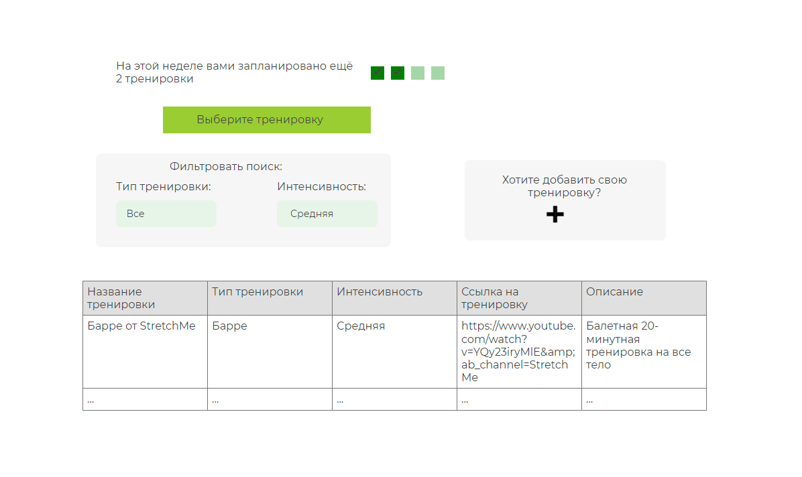

# ok-workout-app

Учебный проект курса
[Kotlin Backend Developer](https://otus.ru/lessons/kotlin/?int_source=courses_catalog&int_term=programming).

Workout app "Better today" - это приложение для составления своего расписания тренировок, позволяющее отслеживать прогресс
в достижении своих целей. Задача приложения - помочь вам придерживаться распорядка занятий, который вы выберете, задайте
необходимое количество тренировок и отмечайте их выполнение, наблюдайте как ваш прогресс растет с каждой выполненной тренировкой!

## Визуальная схема фронтенда

## Документация

1. Маркетинг
    1. [Заинтересанты](./docs/marketing/stakeholders.md)
    2. [Целевая аудитория](./docs/marketing/target-audience.md)
    3. [Конкурентный анализ](./docs/marketing/concurrency.md)
    4. [Анализ экономики](./docs/marketing/economy.md)
    5. [Пользовательские истории](./docs/marketing/user-stories.md)

2. DevOps
    1. [Схема инфраструктуры](./docs/devops/infrastruture)
    2. [Схема мониторинга](./docs/devops/monitoring)

3. Приемочные тесты - [ok-workout-app-acceptance](ok-workout-app-acceptance)

4. Архитектура

   1. [Компонентная схема](./docs/architecture/arch.md)
   2. [Интеграционная схема](./docs/architecture/integration.md)
   3. [Описание API](./docs/architecture/api.md)

# Структура проекта

## Подпроекты для занятий по языку Kotlin
1. [m1l1-hello](m1l1-hello) - Вводное занятие, создание первой программы на Kotlin
2. [ok-workout-app-acceptance](ok-workout-app-acceptance) - Приемочные тесты (ДЗ 2)

